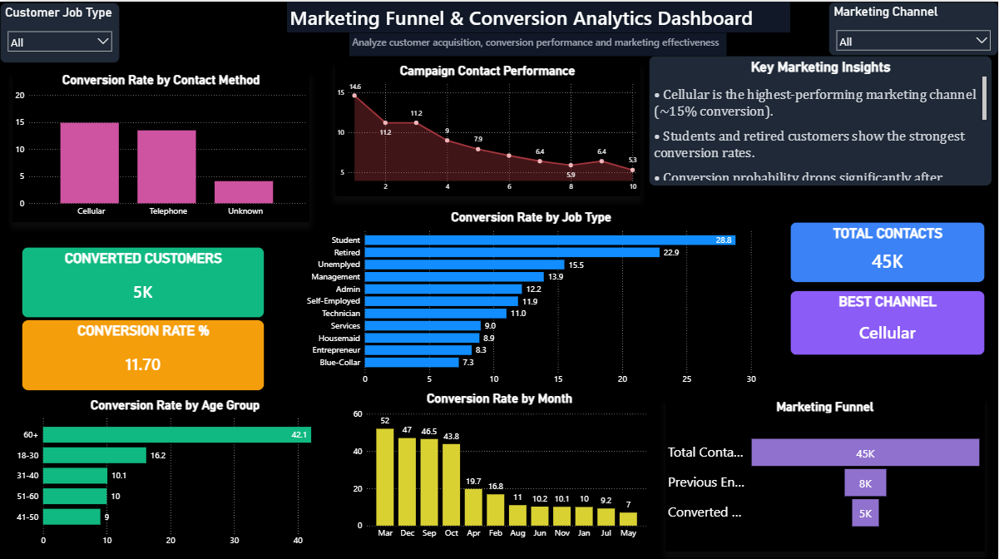

# FUTURE_DS_03 – Marketing Funnel & Conversion Analytics Dashboard

## Overview

This project focuses on analyzing marketing funnel performance and customer conversion behavior using marketing campaign data.

The goal of this project is to understand how customers move through the marketing funnel, identify drop-off points, analyze conversion rates, and provide actionable business recommendations to improve marketing performance.

This project was completed as part of the **Future Interns Data Science & Analytics Internship – Task 3 (2026)**.

---

## Project Objective

The primary objectives of this project are:

- Analyze marketing funnel performance
- Measure customer conversion rates
- Identify high-performing marketing channels
- Understand customer segments with better conversion probability
- Analyze campaign effectiveness
- Identify conversion drop-off points
- Provide actionable business recommendations

This project helps answer important business questions such as:

- Which marketing channels perform best?
- Which customer segments convert the most?
- Where are users dropping off in the funnel?
- How does campaign timing affect conversions?
- How can conversion performance be improved?

---

## Tools & Technologies Used

- **Python (Google Colab)** – Data cleaning and exploratory analysis  
- **Pandas** – Data manipulation and preprocessing  
- **Matplotlib** – Data visualization  
- **Power BI** – Interactive dashboard development  
- **CSV Dataset** – Marketing campaign data source  

---

## Dataset Used

### Bank Marketing Campaign Dataset

The dataset contains customer and campaign-related information collected during direct marketing campaigns conducted by a banking institution.

### Dataset Summary

| Metric | Value |
|--------|------|
| Total Records | 45,211 |
| Total Features | 17 |
| Missing Values | None |
| Converted Customers | 5,289 |
| Conversion Rate | 11.7% |

### Important Features

- Age
- Job Type
- Marital Status
- Education
- Contact Method
- Campaign Month
- Previous Contacts
- Campaign Duration
- Loan Information
- Conversion Status (`y`)

---

## Data Cleaning & Preprocessing

Before analysis, the dataset was cleaned and inspected.

The following preprocessing steps were performed:

- Imported dataset into Google Colab
- Checked dataset shape and dimensions
- Verified missing values
- Inspected data types
- Performed customer conversion analysis
- Created age group segmentation
- Calculated conversion rates by:
  - Contact Method
  - Job Type
  - Age Group
  - Campaign Month
  - Number of Contacts
- Prepared cleaned dataset for Power BI dashboarding

The dataset contained **no missing values** and was ready for analysis.

---

## Exploratory Data Analysis (Python)

Python was used to identify marketing performance patterns and customer conversion behavior.

The following analyses were conducted:

### Customer Conversion Distribution
Analyzed overall conversion rates and customer response behavior.

### Contact Method Performance
Compared conversion rates across:

- Cellular
- Telephone
- Unknown Contact Type

### Job Type Conversion Analysis
Analyzed conversion probability across customer occupations.

### Age Group Conversion Analysis
Studied conversion performance across different age categories.

### Campaign Contact Analysis
Measured the effect of repeated outreach on customer conversion.

### Monthly Campaign Performance
Identified strongest and weakest campaign months.

---

## Marketing Funnel Analysis

A simplified marketing funnel was developed to understand customer progression.

### Funnel Stages

```text
Total Contacts
↓
Engaged Leads
↓
Converted Customers
```

The funnel analysis highlighted major customer drop-offs between outreach and successful conversion.

---

## Power BI Dashboard Features

The dashboard includes:

### KPI Cards
- Total Contacts
- Converted Customers
- Conversion Rate
- Best Marketing Channel

### Funnel Analysis
- Marketing Funnel Visualization

### Conversion Analysis
- Conversion Rate by Contact Method
- Conversion Rate by Age Group
- Conversion Rate by Job Type
- Conversion Rate by Month
- Campaign Contact Performance

### Interactive Filters
The dashboard contains slicers for:

- Job Type
- Marketing Channel
- Campaign Month

These filters enable interactive business analysis and dynamic exploration of marketing performance.

---

## Key Insights

### 1. Cellular Marketing Performs Best
Cellular communication achieved the highest conversion rate.

### 2. Students & Retired Customers Convert More
These customer groups showed the strongest campaign performance.

### 3. Repeated Contact Lowers Conversion
Conversion probability decreases after repeated outreach attempts.

### 4. Marketing Seasonality Matters
March and December delivered the highest campaign success.

### 5. Unknown Contact Records Reduce Effectiveness
Poor contact quality negatively affects campaign performance.

---

## Business Recommendations

Based on the analysis, the following recommendations are suggested:

- Increase investment in cellular campaigns
- Improve customer segmentation strategies
- Reduce excessive campaign contact frequency
- Focus marketing efforts during high-performing months
- Improve customer contact data quality
- Personalize outreach for high-converting customer groups

---


## Dashboard Preview


---

## Project Files Included

```text
FUTURE_DS_03/
│── Marketing_Funnel_Conversion_Analytics_Dashboard.pbix
│── Marketing_Funnel_Dashboard.png
│── Marketing_Funnel_Conversion_Report.pdf
│── Marketing_Funnel_Conversion_Analysis_Report.docx
│── marketing_funnel_cleaned.csv
│── README.md
```

---

## Conclusion

This project demonstrates how marketing funnel analysis can help businesses understand customer behavior, improve conversion rates, and optimize marketing performance.

By combining Python for exploratory analysis and Power BI for visualization, this project provides actionable insights for business stakeholders and supports data-driven decision-making.

---

## Author

**Pushp Jain**  
BTech Computer Science Student  
Aspiring Data Science & Analytics Professional
